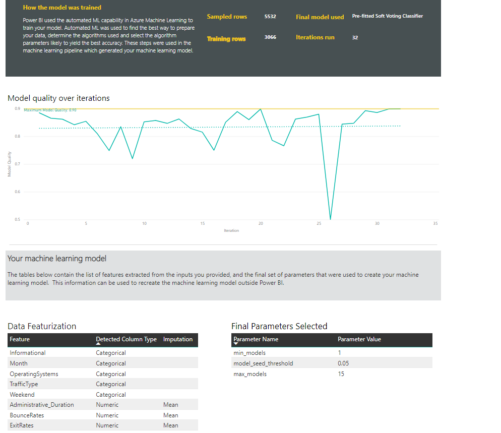
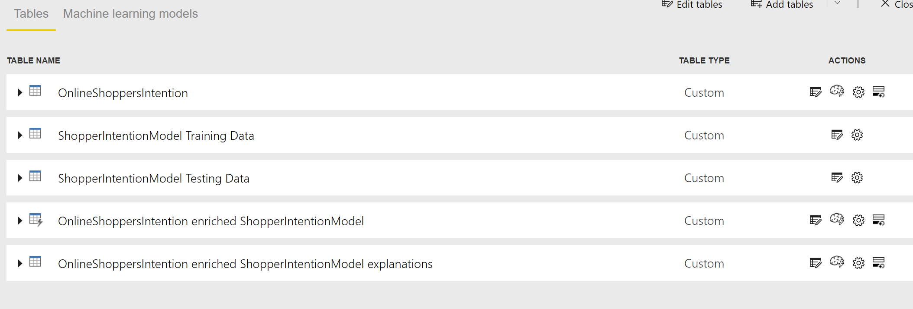
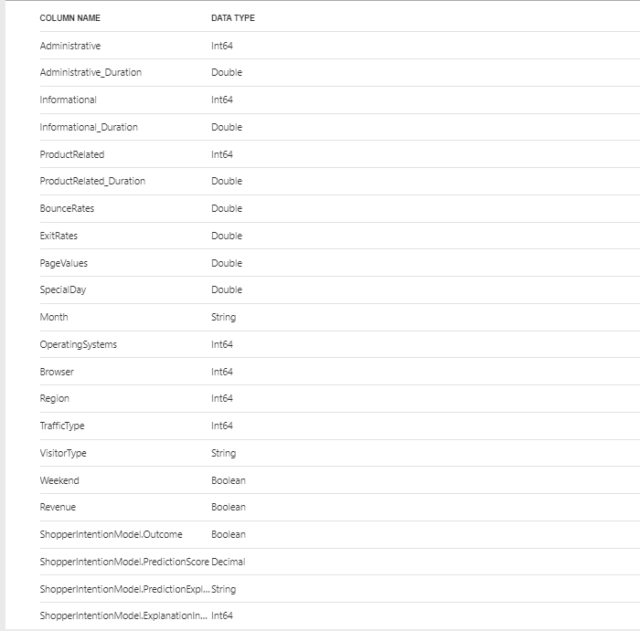
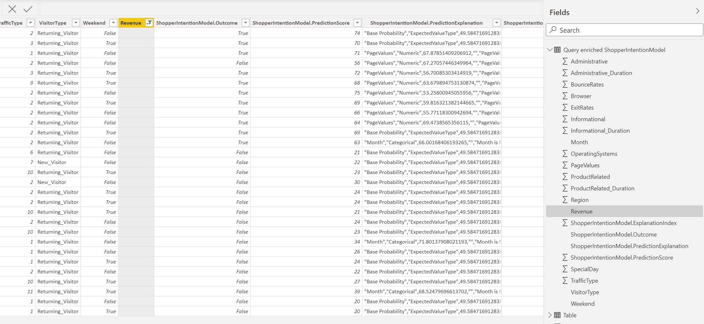

# Auto ML Lab
This lab walks through how to use Auto ML feature within Power BI Service

**Note:** In order to do this lab, you will need access to premium or premium per user capacity.


1. Go to Powerbi.com and nagivate to a workspace that is in a premium or premium per user capacity

2. Click on **New** and select **Dataflow**


3. Click on **Add new tables** 


4. Click on **Text/CSV**, in the next step, for **File path or URL** input below url, click **Next**, click **Transform Data** in the next page

```
https://raw.githubusercontent.com/lipinght/PBICookbook/main/AdvAnalytics/OnlineShoppersIntention.csv
```

5. Scoll to the right, and click the "ABC" on column **Revenue** and change it to **True/False** (click **Add new Step** if prompted) and click **Save & Close**


6. Give your dataflow a name, in this case "OnlineShopperIntention" and click **Save**


7. Click second icon "apply ml model" under actions and click on "Add a machine learning model" 


8. For Outcome Column, select the dropdown to be **Revenue**, click **Next**


9. For Choose a target outcome, select the dropdown to be **true**, click **Next**


10. You can select the attributes to be included in the model, Power BI makes recommendations, we will stick with the recommendations, and click **Next**


11. Type in Model name, in this case "ShopperIntentionModel", Choose a proper amount of time for model to train, taking into account the lab durations, we will do "21 minutes", in reality, you want to give it sufficient time to go through all the algorithms and hyperprarameters and click **Save and Train**


12. The training will kick off, and you will see two additional tables for training data and testing data generated by the model training process. Click on the **Machine Learning Models** tab, you will be able to see the status of the model. Once the model training process is finish, the status will be updated to **Trained**.


13. Click on the second icone under Actions to view training report 


14. Within the training report, you get three tabs, for "Model Performance", you are able to choose the probability Threshold to achive an balance ebtween precision and recall. Click on "see top predictors" button, to see the feature importance. The tab "Accuracy Report" explains model performance metrics, and the "Training Details" outlines details on training details, such as how many iterations were run, what model was chosen and what hyperparameters were usad




15. Click **Apply Model** on top right, choose the table you want to apply the model to, choose your threshold and click **save and apply**, you will see two "Query enriched" tables being created in the dataflow.




16. For this binary prediction model, it adds 4 output columns to the enriched output table: Outcome, PredictionScore, PredictionExplanation, and ExplanationIndex. 



17. You can also connect to the Power BI Dataflows from desktop, and start buiding visuals from the prediction 


