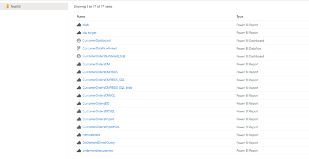
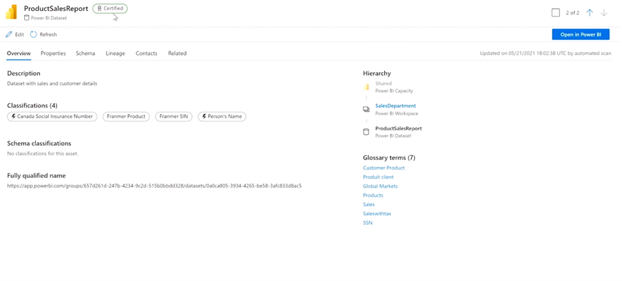
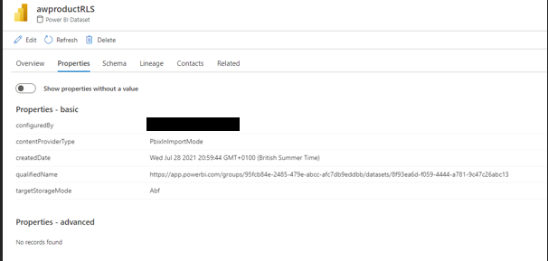
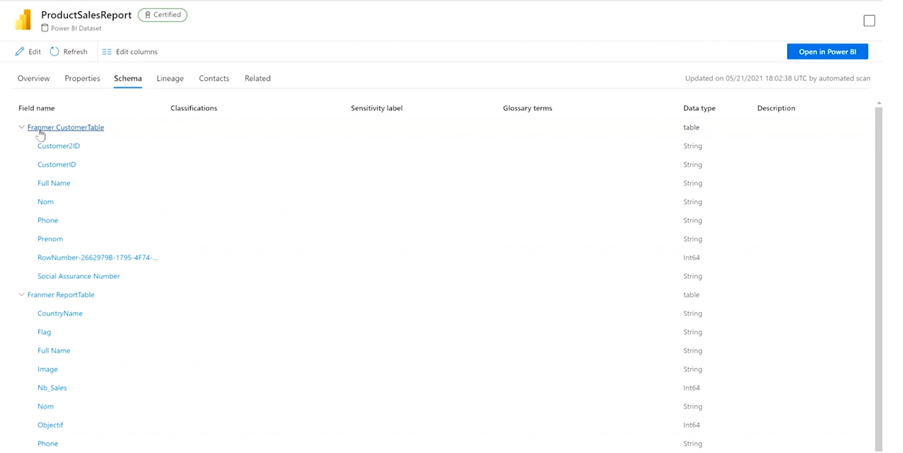
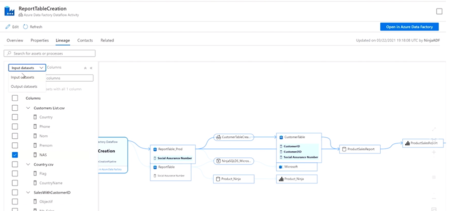
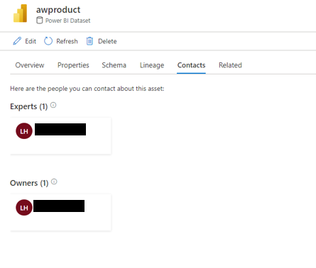
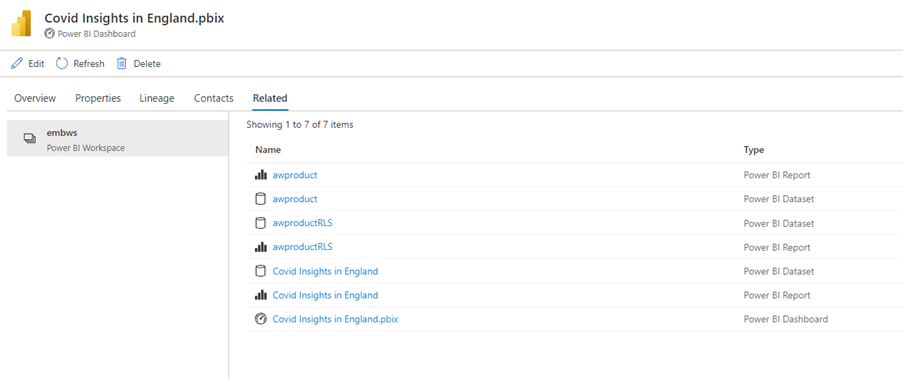

# Purview for Power BI
Purview is a data governance service from Microsoft. Using Purview with Power BI, you will be able to view lineage of your data assets end-to-end, as well as troubleshoot a data pipeline that feeds Power BI datasets and reports. This article elaborates on the aspects of Power BI assets when scanned in Purview.

# Set Up and Scanning
**Note**: Unlike other data sources, users can only use **managed identity** to connect to Power BI. In order to set up Power BI, user will need to have Power BI **Admin** rights. See [this tutorial](https://github.com/lipinght/pbideployment/blob/main/ServicePrincipal/ServicePrincipal.md) for setting up Purview's permission to scan Power BI tenant.

Please see [here](https://docs.microsoft.com/en-us/azure/purview/register-scan-power-bi-tenant#steps-to-register-in-the-same-tenant) for instruction on how to register Power BI as a data source in Purview and [here](https://docs.microsoft.com/en-us/azure/purview/register-scan-power-bi-tenant#scan) for how to scan Power BI in Purview. 

# Assets
Purview scans the entire Power BI tenant (scanning only parts of the tenant is not possible currently),  below artefacts are scanned. 
* Capacity
* Workspaces
* Dataflow
* Dataset
* Report
* Dashboard

Users can filter search results by Power BI Capacity Type, Workspace Name and Artefact Type.
 

When Browsing Power BI assets, all workspaces scanned will be listed.

 
When clicking into a workspace, all scanned assets and their types will be listed

 
# Overview
For assets such as workspace, datasets, dataflows, reports and dashboards, overview tab gives general information about the assets. These general information includes: description, classification, fully qualified name, hierarchy and glossary terms. Hierarchy is capacity/workspace/datasets(report, dataflow, dashboard). Users have the option to open assets in Power BI.

 
# Properties
The properties tab outlines properties for the assets. For dataset, storage mode is listed under ContentProviderType. Other properties listed include author, modifier, creation date, qualified name. 

 
# Schema
Scheme of the dataset is available in the schema tab, which is broken down to tables and columns within a dataset.
 

# Lineage
Lineage is available in Power BI with data sources that feed into Power BI providing an End-to-End view of data lineage. The Lineage in Power BI is available as Data Source -> Dataflow (if applicable) -> Dataset -> Report -> Dashboard.
From lineage view, users will be able to trouble shoot the previous processing steps if a Power BI reports is not working. 

 
# Contacts
In contacts tab, experts and owners can be added from Azure Active Directory, so that users can contact them regarding queries on those assets.

 
# Related
Users can see the related assets in the related tab.

 
# Consideration
* Currently scan is for the entire Power BI tenant, scanning only certain workspaces or capacity is not supported
* Currently only one scan is allowed for Power BI, as opposed to in other data sources different scans can be set up with different rulesets. Users can re-run the same scan multiple times.
* Scans for Power BI can be full scan or incremental scan 
* Power BI Apps are not scanned currently.
* Scanning Deployment pipeline in Power BI is not supported currently
