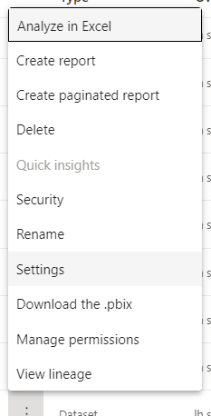

# Utilising RLS Underlying Data Sources Such as Synapse and SQL DB

In addition to using RLS set up in Power BI, you can also leverage RLS set up in your underlying data source such as Synapse Analytics or SQL DB. In order to use RLS in underlying data source, you will need to use DirectQuery Mode in Power BI. Because this is not using RLS in Power BI, it is not limited to Viewer role. Admin, Members, Contributors of the workspace are all subject to RLS in underlying data source.  

## Setting up individual users
1. Set up security group in AAD.
2. Sign into Synapse/SQL DB as AAD admin.
3. Run below codes, you will need to override UserEmailAddress, SchemaName, TableName and ColumnName with your own values, ColumnName is the name of the column that contains security group list. Table Name is the name of the table that contains the mapping of security group to dimensions they are allowed to see. Table example below.

| Country | Analyst | 
|:------:|:-----:|
| Canada | john@contoso.com |

```
CREATE USER [UserEmailAddress] FROM EXTERNAL PROVIDER
GO


SELECT * FROM SYS.DATABASE_PRINCIPALS

EXEC sp_addrolemember 'db_datareader', 'UserEmailAddress'

--------------------------------------
select * from [SchemaName].[TableName] 
--------------------------------------
CREATE SCHEMA Security
GO
CREATE FUNCTION Security.fn_securitypredicate(@ColumnName AS sysname)  
    RETURNS TABLE  
WITH SCHEMABINDING  
AS  
    RETURN SELECT 1 AS fn_securitypredicate_result
	WHERE @ColumnName = USER_NAME()

GO
--------------------------------------
CREATE SECURITY POLICY SalesFilter  
ADD FILTER PREDICATE Security.fn_securitypredicate(ColumnName)
ON SchemaName.TableName
WITH (STATE = ON);

----------------------
GRANT SELECT ON security.fn_securitypredicate TO [UserEmailAddress];


GRANT SELECT ON [SchemaName].[TableName] TO [UserEmailAddress];


```

## Setting up sercurity groups
1. Set up security group in AAD.
2. Sign into Synapse/SQL DB as AAD admin.
3. Run below codes, you will need to override SecurityGroupName, SchemaName, TableName and ColumnName with your own values, ColumnName is the name of the column that contains security group list. Table Name is the name of the table that contains the mapping of security group to dimensions they are allowed to see. Table example below.

| Country | SecurityGroup | 
|:------:|:-----:|
| Canada | TestSG |

```
CREATE GROUP [SecurityGroupName] FROM EXTERNAL PROVIDER;


SELECT * FROM SYS.DATABASE_PRINCIPALS

EXEC sp_addrolemember 'db_datareader', 'SecurityGroupName'

--------------------------------------
select * from [SchemaName].[TableName] 
--------------------------------------
CREATE SCHEMA Security
GO
CREATE FUNCTION Security.fn_securitypredicate(@ColumnName AS sysname)  
    RETURNS TABLE  
WITH SCHEMABINDING  
AS  
    RETURN SELECT 1 AS fn_securitypredicate_result
	WHERE IS_MEMBER (@ColumnName) = 1

GO
--------------------------------------
CREATE SECURITY POLICY SalesFilter  
ADD FILTER PREDICATE Security.fn_securitypredicate(ColumnName)
ON SchemaName.TableName
WITH (STATE = ON);

----------------------
GRANT SELECT ON security.fn_securitypredicate TO [SecurityGroupName];


GRANT SELECT ON [SchemaName].[TableName] TO [SecurityGroupName];


```
## Setting up Power BI

4. Load your data source tables into Power BI desktop using direct query, note the report authors will be subjective to RLS rules in underlying data source.
5. Make your report and publish pbix to Power BI Service, click the three dots on the right hand side of dataset and select “setting”

 



6. In data source credentials, click "Edit Credentials"


7. Choose "Oauth2" as Authentication method, and tick "Report viewers can only access this data source with their own Power BI identities using DirectQuery.", click "Sign in".


8. Add the user or the security group to the workspace by assigning them to one of the roles (viewer contributor, member or admin).

## If your data source is in a Vnet

If your underlying data source is in a Vnet, and your data source is one of the data sources listed [here](https://docs.microsoft.com/en-us/data-integration/vnet/use-data-gateways-sources-power-bi#supported-azure-data-services), you can use Vnet Gateway, which supports SSO. Therefore, you will be able to utilise RLS in underlying data source. For how to set up Vnet Gateway, please see [Vnet Gateway](https://github.com/lipinght/pbideployment/blob/main/VnetGateway/VnetGatewayOverview.md).Otherwise, you will need a traditional [On-Premises Gateway](https://github.com/lipinght/PBICookbook/blob/main/Gateway/GatewayOverview.md). Currently on-prem gateway does not have SSO support, which means you will not be able to use the RLS set up in underlying data source.

# Useful Links

* [RLS in SQL Server](https://docs.microsoft.com/en-us/sql/relational-databases/security/row-level-security?view=sql-server-ver15)