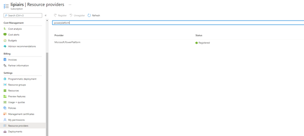
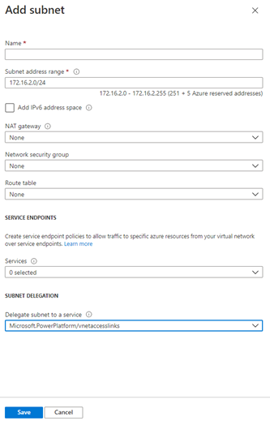
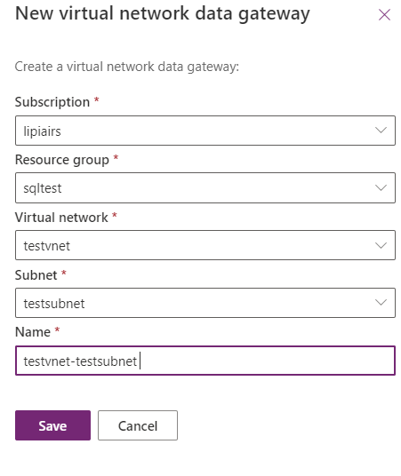
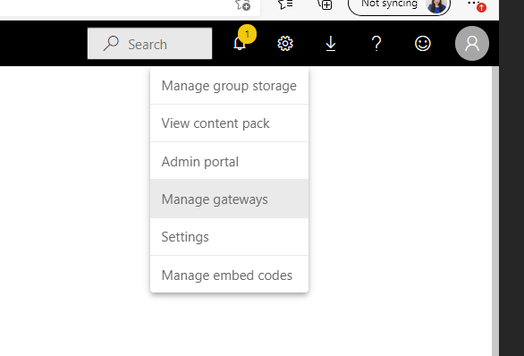
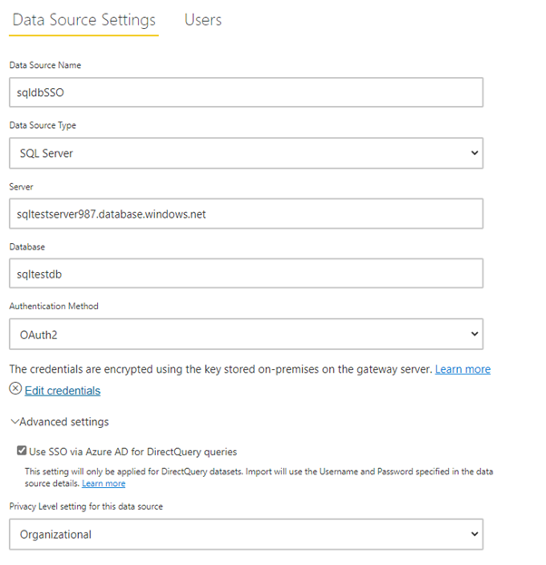
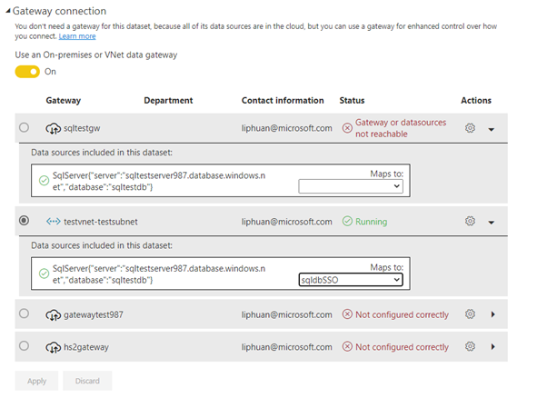

# Overview

| Index | Description |
|:------------------------:|:-----------------------:|
| [Tutorial](https://github.com/lipinght/pbideployment/blob/main/VnetGateway/VnetGatewayOverview.md#tutorial) |This is a tutorial on how to create and use Vnet Gateway in Power BI |
| [Considerations](https://github.com/lipinght/pbideployment/blob/main/VnetGateway/VnetGatewayOverview.md#considerations) |This is a section outlining certain consideration when adopting Vnet Gateway |
| [Useful Resources](https://github.com/lipinght/pbideployment/blob/main/VnetGateway/VnetGatewayOverview.md#useful-resources) |This is a section listing some useful documentations |

# Tutorial
1 Register PowerPlaform as Resource Provider
**Note: you will need to be subscription owner to do below step.**
Sign in to [Azure Portal](https://portal.azure.com),Select a subscription, click on “Resource Provider” on the left navigation pane, search for “Microsoft.PowerPlatform” and click “Register”.
 

2 Designate a subnet to Microsoft Power Platform
**Note: you will need to be in a role with Microsoft.Network/virtualNetworks/subnets/join/action permission on the VNet (e.g. Azure [Network Contributor]( https://docs.microsoft.com/en-us/azure/role-based-access-control/built-in-roles#network-contributor) role) to do below step.**
Go to the Vnet where your data source sits, click on “Subnets” on the left navigation pane, click on “+ Subnet”.
 

Give the subnet a name (You cannot use “gatewaysubnet” as name, as that is reserved word for Azure Gateway Subnet feature). In “Delegate subnet to a service” under “Subnet Delegation”, choose “Microsoft.PowerPlatform/vnetaccesslink” from the dropdown, click “Save”. This subnet will be dedicated to Power Platform Vnet Gateway and cannot be shared with other services.
 

3 Create Vnet Gateway
**Note: You will need the Azure [Network Contributor]( https://docs.microsoft.com/en-us/azure/role-based-access-control/built-in-roles#network-contributor) role) to do below step.**
Sign in to [Power Platform admin center]( https://admin.powerplatform.microsoft.com/), click on “Data(Preview)” on left navigation pane, select “Virtual network data gateways” and click “+New”.
 

From the dropdown, select subscription, resource group, vnet and subnet, name of the gateway will be automatically populated, but can be overridden if you wish. Click “Save”.
 
  
4 Configure Vnet gateway and data source in Power BI
Sign in to Power BI Service, click on “manage gateways” on the top right-hand side menu in Power BI Service
  

You can manage admins if you need to by selecting “administrators”, click on “add data source” on top left
    

Add in the details for your data source, you can choose between basic (SQL authentication) and OAuth2. Vnet Gateway supports AAD SSO for direct query. To enable SSO, click “use SSO via Azure AD for DirectQuery Queries” in “Advance Setting” in Data Source Settings. In scenarios where you are utilizing RLS rules in underlying data source, SSO will need to be enabled. Once SSO is enabled, queries execute under AAD identity of the user that interacts with Power BI. 
  

5 Use Vnet gateway and data source in Power BI dataset
Once data source is set up, go to the dataset you published, and select “settings” 
  

Click on “gateway connection”, choose the Vnet Gateway and in “Maps to” dropdown, choose the data source you set up 
 

# Considerations
* Vnet Gateway is a Premium feature. You will need to assign the workspace on a reserved capacity in order to use Vnet Gateway.
* Unlike OnPrem Gateways where you will need to consider the size of the VM and scaling options, Vnet Gateway is a managed service where autoscale will be managed by Microsoft.
* This [article](https://docs.microsoft.com/en-us/data-integration/vnet/data-gateway-architecture) outlines how Vnet Gateway works in action when a user interacts with a Power BI Report.
* If you are utilising RLS in underlying data source, you will need SSO enabled and use Vnet Gateway if your data source is in a Vnet, because current OnPrem Gateway does not have SSO Support.
* [Current data sources supported for Vnet Gateway](https://docs.microsoft.com/en-us/data-integration/vnet/use-data-gateways-sources-power-bi#supported-azure-data-services)
* [Regions supported for Vnet Gateway](https://docs.microsoft.com/en-us/data-integration/vnet/create-data-gateways#regions-supported-for-vnet-data-gateways) 

# Useful Resources
* [Vnet Gateway Overview](https://docs.microsoft.com/en-us/data-integration/vnet/overview)
* [Vnet Gateway Architecture](https://docs.microsoft.com/en-us/data-integration/vnet/data-gateway-architecture)
* [Create Vnet Gateway](https://docs.microsoft.com/en-us/data-integration/vnet/create-data-gateways)
* [Manage Vnet Gateway](https://docs.microsoft.com/en-us/data-integration/vnet/manage-data-gateways)
* [Use Vnet Gateway in Power BI](https://docs.microsoft.com/en-us/data-integration/vnet/use-data-gateways-sources-power-bi)
* [Use Vnet Gateway in Power Platform Dataflows](https://docs.microsoft.com/en-us/data-integration/vnet/data-gateway-power-platform-dataflows)
* [Vnet Gateway FAQ](https://docs.microsoft.com/en-us/data-integration/vnet/data-gateway-faqs)

